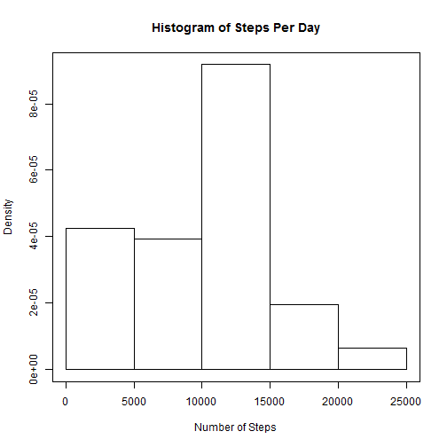
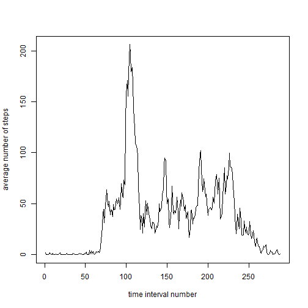
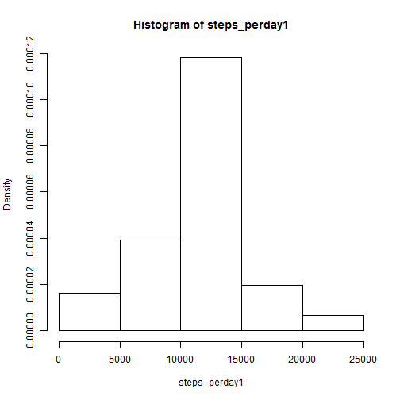
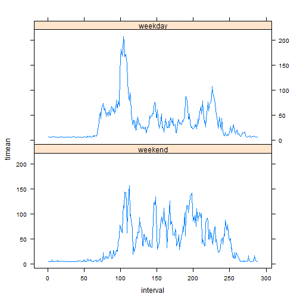

Personal movement data - number of steps taken in a interval of 5 mins - has been collected using activities monitering devices. The data for this study has been provided as part of the course material

There three objectives of this study:
  1. understand the activity pattern, investigate the mean number of steps taken per day & mean of number of steps per 5 min slots
  2. understand the significance of ignoring or including unavailable data (NA)
  3. Weekday VS weekend behaviour

### Data Exploration

Load the data & perform initial exploration

```r
activity <- read.csv("activity.csv")
head(activity)
```

```
##   steps       date interval
## 1    NA 2012-10-01        0
## 2    NA 2012-10-01        5
## 3    NA 2012-10-01       10
## 4    NA 2012-10-01       15
## 5    NA 2012-10-01       20
## 6    NA 2012-10-01       25
```

```r
tail(activity)
```

```
##       steps       date interval
## 17563    NA 2012-11-30     2330
## 17564    NA 2012-11-30     2335
## 17565    NA 2012-11-30     2340
## 17566    NA 2012-11-30     2345
## 17567    NA 2012-11-30     2350
## 17568    NA 2012-11-30     2355
```

```r
summary(activity)
```

```
##      steps                date          interval     
##  Min.   :  0.00   2012-10-01:  288   Min.   :   0.0  
##  1st Qu.:  0.00   2012-10-02:  288   1st Qu.: 588.8  
##  Median :  0.00   2012-10-03:  288   Median :1177.5  
##  Mean   : 37.38   2012-10-04:  288   Mean   :1177.5  
##  3rd Qu.: 12.00   2012-10-05:  288   3rd Qu.:1766.2  
##  Max.   :806.00   2012-10-06:  288   Max.   :2355.0  
##  NA's   :2304     (Other)   :15840
```

From the 'head' & 'tail' operation, it is clear that we have data from 1 Oct 2012 to 30 Nov 2012 i.e, 61 days in all. The number of 5 min interval in a day & all 61 day is - 

```r
i5pd <- 24*60/5 # 5 min intervals in a day
i5pd
```

```
## [1] 288
```

```r
i5pd*61         # 5 min intervals in 61 days
```

```
## [1] 17568
```
The number of 5 min intervals in 61 days is 17568 and this the number of rows in activities. Also, the number of data points for each day (as seen the summary output) is 288 which again is equal to the 5 min intervals in a day. Thus, there are no missing rows of 5 min interval.

Also, from this exploration we observe that there are 2304 NA's (from summary output).

### Stats of Steps per Day

Statistics of steps taken per day is calculated. For this study all the NA's are ignored.


```r
steps_perday <- tapply(activity$steps,activity$date,sum,na.rm=TRUE)
hist(steps_perday,freq=FALSE,ann=FALSE)
title(main="Histogram of Steps Per Day",xlab="Number of Steps",ylab="Density")
box()
```

 

```r
tapply(activity$steps,activity$date,mean,na.rm=TRUE) # mean for each day
```

```
## 2012-10-01 2012-10-02 2012-10-03 2012-10-04 2012-10-05 2012-10-06 
##        NaN  0.4375000 39.4166667 42.0694444 46.1597222 53.5416667 
## 2012-10-07 2012-10-08 2012-10-09 2012-10-10 2012-10-11 2012-10-12 
## 38.2465278        NaN 44.4826389 34.3750000 35.7777778 60.3541667 
## 2012-10-13 2012-10-14 2012-10-15 2012-10-16 2012-10-17 2012-10-18 
## 43.1458333 52.4236111 35.2048611 52.3750000 46.7083333 34.9166667 
## 2012-10-19 2012-10-20 2012-10-21 2012-10-22 2012-10-23 2012-10-24 
## 41.0729167 36.0937500 30.6284722 46.7361111 30.9652778 29.0104167 
## 2012-10-25 2012-10-26 2012-10-27 2012-10-28 2012-10-29 2012-10-30 
##  8.6527778 23.5347222 35.1354167 39.7847222 17.4236111 34.0937500 
## 2012-10-31 2012-11-01 2012-11-02 2012-11-03 2012-11-04 2012-11-05 
## 53.5208333        NaN 36.8055556 36.7048611        NaN 36.2465278 
## 2012-11-06 2012-11-07 2012-11-08 2012-11-09 2012-11-10 2012-11-11 
## 28.9375000 44.7326389 11.1770833        NaN        NaN 43.7777778 
## 2012-11-12 2012-11-13 2012-11-14 2012-11-15 2012-11-16 2012-11-17 
## 37.3784722 25.4722222        NaN  0.1423611 18.8923611 49.7881944 
## 2012-11-18 2012-11-19 2012-11-20 2012-11-21 2012-11-22 2012-11-23 
## 52.4652778 30.6979167 15.5277778 44.3993056 70.9270833 73.5902778 
## 2012-11-24 2012-11-25 2012-11-26 2012-11-27 2012-11-28 2012-11-29 
## 50.2708333 41.0902778 38.7569444 47.3819444 35.3576389 24.4687500 
## 2012-11-30 
##        NaN
```

```r
mean(steps_perday)  # mean of sum of each day
```

```
## [1] 9354.23
```

```r
#
tapply(activity$steps,activity$date,median,na.rm=TRUE) # median for each day
```

```
## 2012-10-01 2012-10-02 2012-10-03 2012-10-04 2012-10-05 2012-10-06 
##         NA          0          0          0          0          0 
## 2012-10-07 2012-10-08 2012-10-09 2012-10-10 2012-10-11 2012-10-12 
##          0         NA          0          0          0          0 
## 2012-10-13 2012-10-14 2012-10-15 2012-10-16 2012-10-17 2012-10-18 
##          0          0          0          0          0          0 
## 2012-10-19 2012-10-20 2012-10-21 2012-10-22 2012-10-23 2012-10-24 
##          0          0          0          0          0          0 
## 2012-10-25 2012-10-26 2012-10-27 2012-10-28 2012-10-29 2012-10-30 
##          0          0          0          0          0          0 
## 2012-10-31 2012-11-01 2012-11-02 2012-11-03 2012-11-04 2012-11-05 
##          0         NA          0          0         NA          0 
## 2012-11-06 2012-11-07 2012-11-08 2012-11-09 2012-11-10 2012-11-11 
##          0          0          0         NA         NA          0 
## 2012-11-12 2012-11-13 2012-11-14 2012-11-15 2012-11-16 2012-11-17 
##          0          0         NA          0          0          0 
## 2012-11-18 2012-11-19 2012-11-20 2012-11-21 2012-11-22 2012-11-23 
##          0          0          0          0          0          0 
## 2012-11-24 2012-11-25 2012-11-26 2012-11-27 2012-11-28 2012-11-29 
##          0          0          0          0          0          0 
## 2012-11-30 
##         NA
```

```r
median(steps_perday) # median for sum of each day
```

```
## [1] 10395
```
<br> 
Mean of sum of steps per day equals to 9354.23 & median is 10395. 

### Time Series Plot of 5 min intervals

```r
# define base interval
binterval <- matrix(,nrow=61*i5pd,ncol=0)
for (i in 1:61) {
  for (k in 1:i5pd) {
    binterval[i5pd*(i-1)+k] <- k 
  } 
}
activity <- cbind(activity,binterval)
timean <- tapply(activity$steps,activity$binterval,mean,na.rm=TRUE)
int <- rownames(timean)
int <- as.numeric(int)
plot(int,timean,type="l",xlab="time interval number",ylab="average number of steps")
```

 

```r
which.max(timean)
```

```
## 104 
## 104
```
104 minute interval contains the maximum number of steps on average across all the days in the dataset.

### Effect of NA - Imputting missing values
Now the NA is replaced with a simple estimate. The estimate taken here is the average of steps taken in all of 61 days ignoring the NA's. The NA's are replaced with is estimare & studies performed.


```r
# in putting missing values
sum(is.na(activity$steps))
```

```
## [1] 2304
```
Number of NA's are 2304 (also observed in the data summary)


```r
meanall <- mean(activity$steps,na.rm=TRUE)
newadf <- activity
k<-0L
for (i in 1:length(activity$steps)){
  if(is.na(activity$steps[i])){
    k <- k + 1L
    newadf$steps[i]<-meanall
  }
}
k  # number of values changed, should be equal to number of NA's
```

```
## [1] 2304
```

```r
meanall
```

```
## [1] 37.3826
```

```r
steps_perday1 <- tapply(newadf$steps,newadf$date,sum,na.rm=TRUE)
mean(steps_perday1)
```

```
## [1] 10766.19
```

```r
median(steps_perday1)
```

```
## [1] 10766.19
```

```r
hist(steps_perday1,freq=FALSE)
```

 
With the replacement of NA's with an estimate, the mean has increased. The historam is "more" symmetric & normal than when NA's are ignored. Also, significant concentration can be observed at the mean.
Thus replacing the NA has effect of the data summary.

### Weekdays Plot

```r
newadf$date<-as.Date(newadf$date,"%Y-%m-%d")
weekdaysl <- c('Monday', 'Tuesday', 'Wednesday', 'Thursday', 'Friday')
newadf <- transform(newadf, date = factor((weekdays(newadf$date) %in% weekdaysl)+1L,levels=1:2, labels=c('weekend', 'weekday')))

actwend <- subset(x=newadf,subset=grepl(pattern="weekend",x=newadf$date),select=c(steps,binterval,date))
timeanwend <- tapply(actwend$steps,actwend$binterval,mean)
wenddf <- data.frame(timeanwend,actwend$date[1:i5pd],actwend$binterval[1:i5pd])
colnames(wenddf) <- c("timean","date","interval")

actwday <- subset(x=newadf,subset=grepl(pattern="weekday",x=newadf$date),select=c(steps,binterval,date))
timeanwday <- tapply(actwday$steps,actwday$binterval,mean)
wdaydf <- data.frame(timeanwday,actwday$date[1:i5pd],actwday$binterval[1:i5pd])
colnames(wdaydf) <- c("timean","date","interval")
wdf <- rbind(wenddf,wdaydf)
library(lattice)
xyplot(timean ~ interval | date, data=wdf,type='l', layout=c(1,2))
```

 
<br>
As seen from the plots, there is a difference in the weekday & weekend activities.
